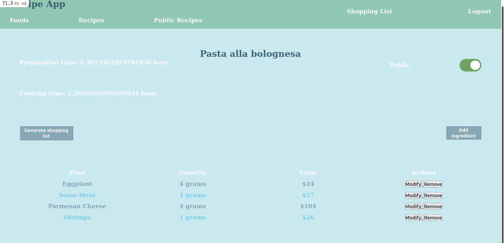

# The Oracle Blog

The Recipe app keeps track of all your recipes, ingredients, and inventory. It will allow you to save ingredients, keep track of what you have, create recipes, and generate a shopping list based on what you have and what you are missing from a recipe. Also, since sharing recipes is an important part of cooking the app should allow you to make them public so anyone can access them.

## Built With

- Ruby
- Rails
- JavaScript
- devise
- cancancan
- bullet
- postgree
- HTML/CSS

## Getting Started

To get a local copy up and running follow these simple example steps.

### Prerequisites

- Git/GitHub;
- Optional ( IDE installed in your machine ) - recommended IDE: Vscode, Rubymine;
- Ruby Installed in your machine;
- Rails gem installed in your machine;

### Setup

- To clone this repo:
  - Open the Terminal(Mac/Linux) or the Cmd (Windows);
  - Navigate to where you want to paste the Repo folder;
  - Type `git clone git@github.com:JbirdL86/recipe-app.git`;
  - With you preffered IDE open the folder that you cloned before;
- Configuring DB access:
  - Inside the database.yml file modify the Env variables for getting the username and password to access psql database;
- Creating DB:
  - Run `rails db:create` to create a empty databse for the project.
  - Run `rails db:migrate` for creating the project tables.
  - If you want, you can run `rails db:seed` to create default values for the tables: Users, comments, likes, posts.   
  
### Run Website  

- Run `rails s` for starting the server;
- Access [http://localhost:3000/](http://localhost:3000/) in a browser of your choice.
  
### Run Linters

- Run rubocop locally with: `Rspec .` to run all tests or `Rspec [file]` for testing a specific file;
- Run stylelint locally with : `npx stylelint "**/*.{css,scss}"` or `npx stylelint "**/*.{css,scss}" --fix` for autofixing errors.

### Run Tests

- Run `rails spec`.

## Authors

👨‍💻 **Nelsino**

- GitHub: [@nelsinofrancisco](https://github.com/nelsinofrancisco)
- Twitter: [@nelsino_s](https://twitter.com/nelsino_s)
- LinkedIn: [LinkedIn](https://www.linkedin.com/in/nelsinofrancisco/)

👤 **Juan Gonzalez**

- GitHub: [@JbirdL86](https://github.com/JbirdL86)
- Twitter: [@twitterhandle](https://twitter.com/JuanLui06498455)
- Linkedin: [linkedin](https://www.linkedin.com/in/juan-luis-0551921aa/)

## 🤝 Contributing

Contributions, issues, and feature requests are welcome!

Feel free to check the [issues page](../../issues/).

## Show your support

Give a ⭐️ if you like this project!

## 📝 License

This project is [MIT](./MIT.md) licensed.
